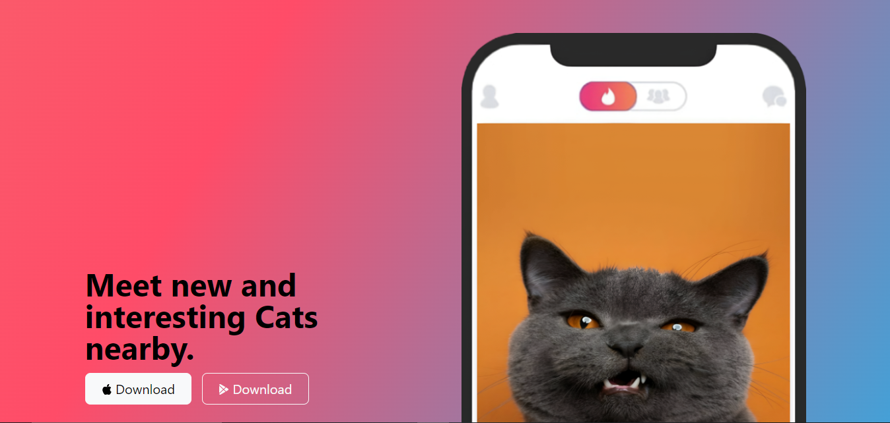

## KittyKorner-Bootstrap Easy Styling

## Using Bootstrap CSS made easier for everyone!

<h2 align="center">
  <a href="https://faseehblogs.vercel.app/" target="_blank">faseehblogs.vercel.app</a>
</h2>

<div align="center">
  
</div>

<br/>

<center>

[](https://forthebadge.com) &nbsp;
[](https://forthebadge.com) &nbsp;
[](https://forthebadge.com) &nbsp;

</center>

<h3 align="center">
    🔹
    <a href="https://github.com/faseeh41/Bits-0f-C0de/issues">Report Bug</a> &nbsp; &nbsp;
    🔹
    <a href="https://github.com/faseeh41/Bits-0f-C0de/issues">Request Feature</a>
</h3>

## Built With

This project was built using these technologies.

- Css
- Bootstrap
- VsCode
- Html

## Features

**📃 Markdown Support**

**✏️ Easy to customize and write of your own**

**🎨 Styled with Bootstrap Css**

## Getting Started

### 🛠 Installation and Setup Instructions

To get started just clone this repository. You will need to download live server on your machine.

Run

```
run on live server
```
Open with your browser to see the result.

## Usage Instructions

To write your own create a new index.html and modify according to your own on requirements.

### Show your support

Give a ⭐ if you like this website!

<a href="https://www.buymeacoffee.com/faseeh41" target="_blank"></a>
